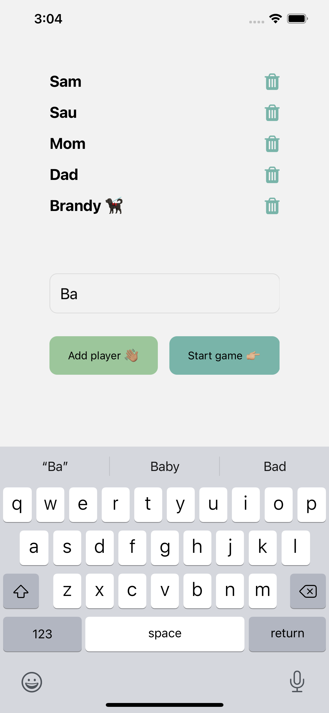
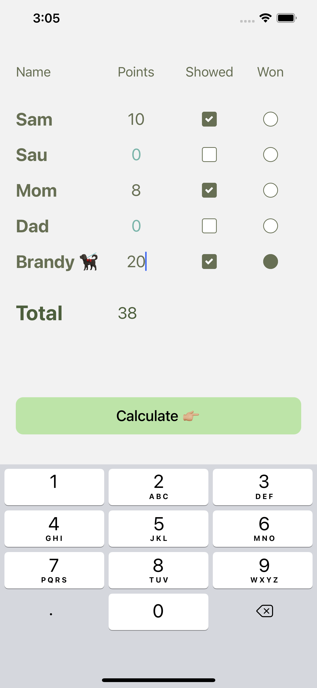
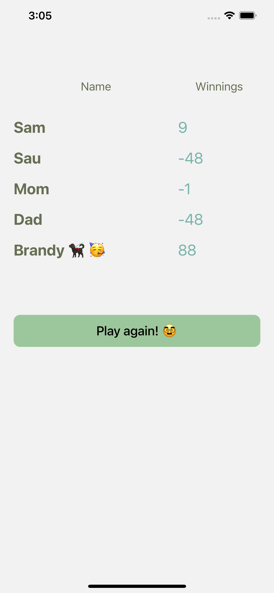

# Marriage Mal Calculator

Marriage Mal Calculator is a super simple app I made in order for people to quickly be able to calculate the results of a game of [Marriage](<https://en.wikipedia.org/wiki/Marriage_(card_game)>). There is no backend required for this—it's purely frontend. I was also bored while recovering from Covid. Also, I used React Native expo to create and share this, because I don't want to pay the \$99 to share through TestFlight 🤷🏽

## Installation

Use the package manager `npm` or `yarn` to install the necessary dependencies.

## Usage

Run with

```bash
expo start
```

## Visuals





## Contributing

Pull requests are welcome. For major changes, please open an issue first to discuss what you would like to change.

## License

[MIT](https://choosealicense.com/licenses/mit/)
